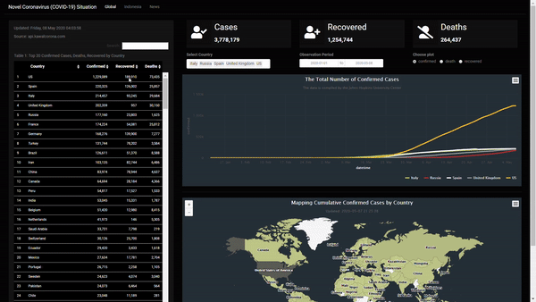

# COVID-19 Dashboard Monitoring

Dashboard monitoring the situation of covid-19 globally and in Indonesia specifically. Built using Shiny and Shinydashboard in R. This project aims to provide the information visually the total number of confirmed cases, recovered, and death. The data will be updated automatically every hour.

## Acknowledgments :sparkles:

- Ethical Hacker Indonesia (kawalcorona.com) for providing API http://api.kawalcorona.com/ to get the data.